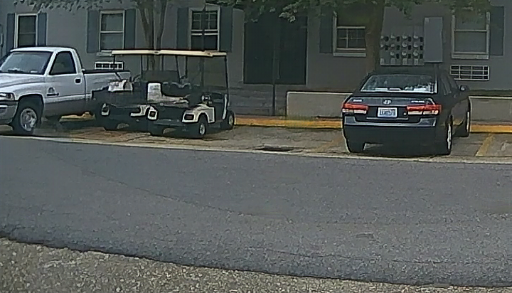

# M2GAN: A Multi-Stage Multi-task Recurrent Generative Adversarial Networkfor Image Rain Removal on Autonomous Vehicles
## Needed 
1. Python 3.6
2. Pytorch 1.0.0
3. pytorch-fid
4. Semantic Segmentation[1]
```
git clone  --single-branch --branch cityscapes https://github.com/CSAILVision/semantic-segmentation-pytorch.git semantic
curl http://sceneparsing.csail.mit.edu/model/pytorch/ade20k-resnet50dilated-ppm_deepsup/decoder_epoch_20.pth --create-dirs -o semantic/ade20k-resnet50dilated-ppm_deepsup/decoder_epoch_20.pth
curl http://sceneparsing.csail.mit.edu/model/pytorch/ade20k-resnet50dilated-ppm_deepsup/encoder_epoch_20.pth --create-dirs -o semantic/ade20k-resnet50dilated-ppm_deepsup/encoder_epoch_20.pth
```
*Note: change lib root in all semantic code
```
from lib.nn import SynchronizedBatchNorm2d    ---->   from semantic.lib.nn import SynchronizedBatchNorm2d
``` 
## Dataset
1. Download our testset from [link](https://drive.google.com/file/d/1D0n4fD25TyDTcwda7flGS6SMQnQyKZu4/view?usp=sharing)
2. Download raindrop[2] testset from [link](https://drive.google.com/open?id=1e7R76s6vwUJxILOcAsthgDLPSnOrQ49K)
## Model
Download all model from [link](https://drive.google.com/drive/folders/1UNDkTP3BDKhvge3TLSBfFFuSqvhW8TIO?usp=sharing)
## Run
1. Derain our testset
```
python3 test.py --data testset/our_testset --out result/our_testset --checkpoints checkpoints/M2GAN_our_testset
python3 test.py --data testset/our_testset --out result/our_testset --checkpoints checkpoints/No_Seg
python3 test.py --data testset/our_testset --out result/our_testset --checkpoints checkpoints/No_Disc
```
Result sample

a. Rain

b. M2GAN derain

c. Ground truth


2. Derain raindrop dataset test a
```
python3 test.py --data testset/raindrop_test_a --out result/raindrop_test_a --checkpoints checkpoints/M2GAN_raindrop
```
## Reference
[1] [Semantic Segmentation on MIT ADE20K dataset in PyTorch](https://github.com/CSAILVision/semantic-segmentation-pytorch/tree/cityscapes) 

[2] [Attentive Generative Adversarial Network for Raindrop Removal from A Single Image (CVPR'2018)](https://github.com/rui1996/DeRaindrop)